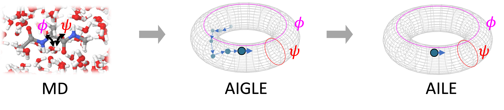

  

# Using AIGLE and AILE to model the dihedral-angle dynamics of alanine dipeptide.

### Step 1: MD
Use md_unbiased/run.py to generate a 100ns-long trajectory data of alanine dipeptide with explicit water.
Use md_unbiased/process_traj.py to get the trajectory of dihedral angles.
use metadynamics/run_metad.py to calculate the free energy surface

### Step 2: train_AIGLE.ipynb
Train the AIGLE model. GPU is recommended. Otherwise calculating correlation function takes a long time.
The model configuration has been stored in the "gle_paras" folder.

### Step 3: simulate.ipynb
Simulate AIGLE and AILE for 20us

